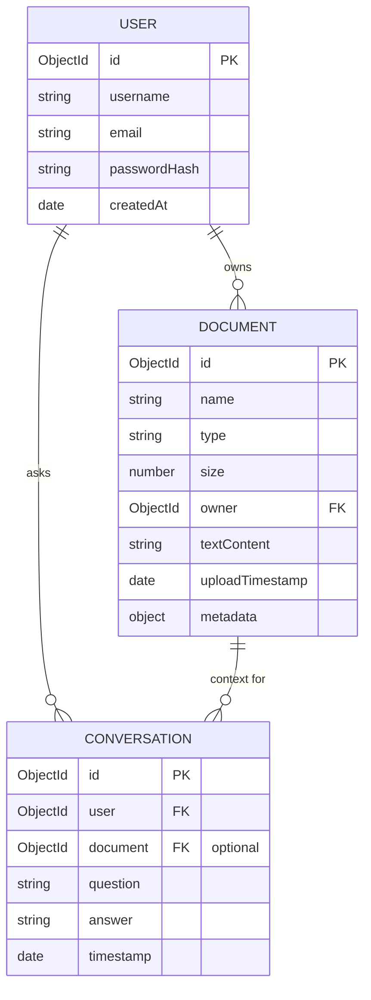

# System Architecture & Design

This document details the architectural design and structural choices implemented in **CognitiveKB** (AI-Powered Knowledge Base Assistant).

---

## 1. Project Directory Structure

The repository is organized as a clean **Monorepo** dividing the backend service, frontend application, and deployment layers:

```
ai-knowledge-base-assistant/
├── backend/                  # Node.js + Express + TypeScript Server
│   ├── src/
│   │   ├── controllers/      # Route handler logics
│   │   ├── middleware/       # JWT Auth validator
│   │   ├── models/           # Mongoose schemas (User, Doc, Chat)
│   │   ├── tests/            # Supertest Jest API test suites
│   │   └── server.ts         # Main server initialization driver
│   ├── Dockerfile
│   ├── tsconfig.json
│   └── jest.config.js
│
├── frontend/                 # Vite + React + TypeScript + Tailwind SPA
│   ├── src/
│   │   ├── components/       # Reusable layout and upload forms
│   │   ├── context/          # Shared Auth State provider
│   │   ├── pages/            # Login, Dashboard, Docs, Chat views
│   │   ├── utils/            # Custom Axios API client interceptors
│   │   ├── index.css         # Styling system & animations
│   │   └── main.tsx          # Client mount entry point
│   ├── Dockerfile
│   ├── nginx.conf            # Container web server router config
│   └── vite.config.ts
│
└── docker-compose.yml        # Multi-container orchestration layout
```

---

## 2. Database Design

We use MongoDB as the document store. Relations are established using references (`Schema.Types.ObjectId`):



- **User**: Holds login credentials. Passwords are encrypted using standard `bcryptjs`.
- **Document**: Holds file parameters and the fully parsed text content. Word and page count statistics are compiled at upload.
- **Conversation**: Tracks questions and AI replies, linking back to the user and the contextual document (or left null if querying the entire library).

---

## 3. Authentication Approach

Authentication is stateless and handled via **JSON Web Tokens (JWT)**:
- On successful login or signup, the backend generates a signed token containing the user's ID and email.
- The client stores this token in browser local storage and injects it into the `Authorization` header of all subsequent API calls via an Axios Request Interceptor.
- The backend validates the signature of this token on protected routes using the `authenticateToken` middleware.
- If a token expires, the server returns a `401 Unauthorized` response which is caught by the client's Axios Response Interceptor, triggering an automatic logout and redirect.

---

## 4. Key Engineering Decisions

- **In-Memory Database Option**: The system checks for the presence of a MONGODB_URI env variable. If empty, it spins up an instance of `mongodb-memory-server` dynamically. This facilitates seamless evaluation without database setup.
- **In-Memory Multer Processing**: Multer is configured to use memory buffers instead of storage directories. Extracted text is parsed and committed directly to the database, ensuring zero local file leaks on the server filesystem.
- **Fail-Soft Demo Mode**: If the Gemini API key is missing from the environment, the chat handler intercepts requests and runs a chat simulator. This ensures the UI remains fully interactive during tests.

---

## 5. Scaling and Future Improvements

If this application were to scale to millions of documents, several enhancements would be introduced:
- **Vector Embeddings (Vector DB)**: Instead of feeding raw extracted text into the LLM prompt, split documents into semantic chunks (e.g., 500 tokens each), generate vector embeddings (using a model like `text-embedding-004`), and store them in a specialized Vector Database (e.g., Pinecone, Qdrant, or MongoDB Vector Search). When a user asks a question, retrieve only the top $k$ matching chunks, minimizing LLM token usage and pricing.
- **Asynchronous Task Queue (Redis + BullMQ)**: Parsing large PDF files (especially scanned OCR files) takes significant processing time. This should be delegated to background worker threads using queues like Redis/BullMQ to prevent blocking the HTTP server thread.
- **Streaming Responses**: Modify the backend `/api/ask` route to return a Server-Sent Events (SSE) stream, allowing answers to render word-by-word in real-time, greatly improving the user experience.
- **Redis Caching**: Cache common questions or frequently previewed documents to speed up response times.
